# Welcome BJJ-Manager
Welcome to the ultimate guide to building a BJJ gym membership manager! In this comprehensive article, we will explore the key aspects of creating a powerful and efficient tool to manage memberships in Brazilian Jiu-Jitsu gyms. Whether you are a gym owner, a developer, or simply interested in the world of BJJ, this guide will provide you with valuable insights and step-by-step instructions to build your very own BJJ gym membership manager.

[Live program](https://bjj-manager-bd4eeb40019e.herokuapp.com/)
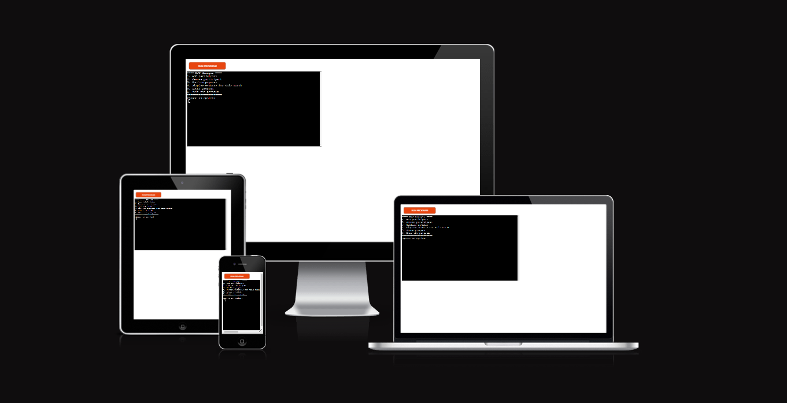

## Project Goals
---
Managing memberships in a BJJ gym can be a complex and time-consuming task. From tracking payments to maintaining member records, there are numerous challenges that gym owners face on a daily basis. This is where a BJJ gym membership manager comes in. By automating and streamlining the membership management process, you can save time, reduce administrative errors, and provide a better experience for both gym owners and members.

## User Goals
---
1. Add a participant:
    * User can enter the participant's name.
    * User can choose the participant's group (Beginner or Advanced).
    * User can confirm whether the payment has been made.
 
 

2. Remove a participant:
    * User can enter the name of the participant to be removed.
    * The program will remove the participant from the list.
 
 

3. Confirm payment:

    * User can enter the name of the participant to confirm payment for.
    * The program will update the payment status of the participant as "Paid."
 
 

4. Display members for the current month:

    * The program will retrieve and display the list of participants for the current month.
    * For each participant, the program will show their name, group, and payment status (Paid or Not Paid).
 
 

5. About the program:

    * The program will provide information about the BJJ Manager tool.
    * User can learn about the program's features and benefits.
 
 

6. Exit the program:

    * User can choose to exit the program.

## Features
---
### Existing :
---
At beginning, the user is presented with the program menu from which we can choose the appropriate options
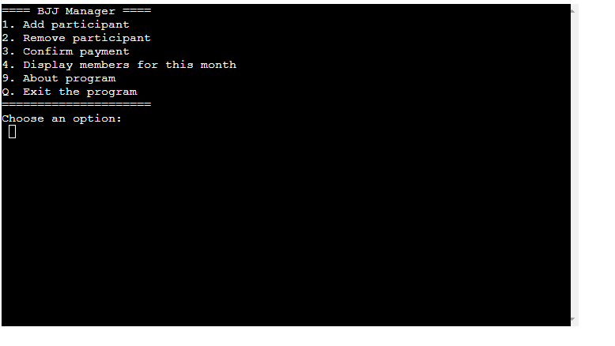

In order from the top, we can add a new participant of our classes, in this option we must include the name and surname, the type of class that the participant will attend and also whether he has paid for his membership
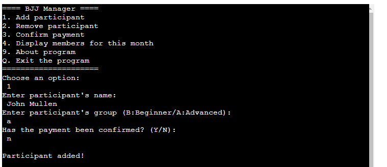

Then we can remove our participant from the list, this will be done by providing the name and surname of the participant
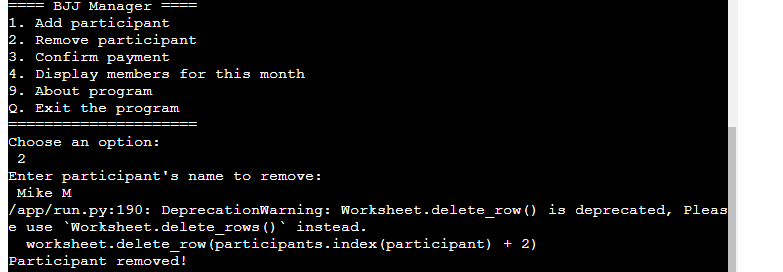

Next, we confirm that you have paid for your membership at a later date this option will be available after providing the name and surname of the participant
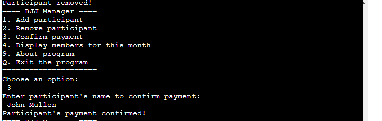

Then the user can view the list of participants from a given month along with the classes they attend and whether their membership is currently paid
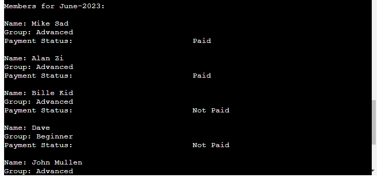

Next we can read a short note about the program itself 
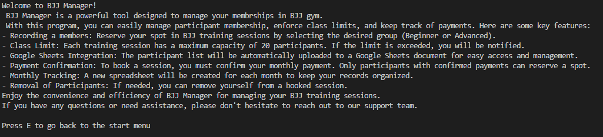

Future Features:
1. Attendance Tracking: Implement a feature to track participant attendance for each training session. This could help monitor regular attendance and identify patterns or trends.

2. Injury Tracking: Incorporate a feature to track participant injuries or health conditions. This information can help instructors or coaches manage training sessions effectively and ensure participant safety.

3. Injury Tracking: Incorporate a feature to track participant injuries or health conditions. This information can help instructors or coaches manage training sessions effectively and ensure participant safety.

## Data Mode :
---
* Name: The name of the participant. (String)
* Group: The group to which the participant belongs (Beginner or Advanced). (String)
* Payment Confirmed: Indicates whether the payment has been confirmed for the participant. (Boolean)

This data model represents the information associated with each participant in the BJJ Manager program. It includes fields such as the participant's name, group, and payment confirmation status. The data model allows for storing and managing participant data efficiently, enabling functionalities like adding participants, removing participants, confirming payments, and displaying the list of members.

Additionally, the program utilizes a spreadsheet, which serves as the external storage for the participant data. The spreadsheet is organized by months, with each month having a separate worksheet. The worksheets contain the participant information, including their name, group, and payment confirmation status.

By using this data model and integrating with Google Sheets, the BJJ Manager program provides a convenient and efficient solution for managing participant memberships and tracking payments in a BJJ gym.

## Testing
---
This program was tested manually by the following steps:
* Tested in a  Code Institute Heroku  terminal
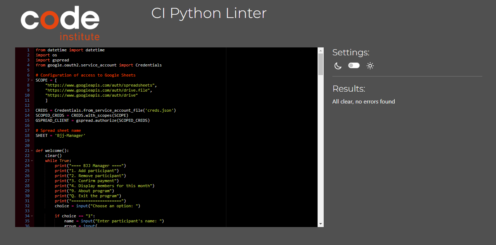
* Tested by the [Snyk Code](https://snyk.io/code-checker/python/) 
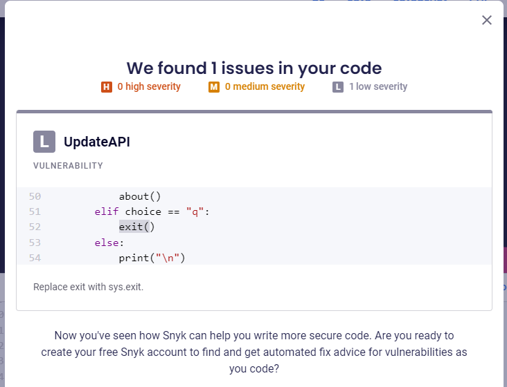
* Tested many times manually by the developer

## Bugs 
----
### Resolved bugs
* To create spreadsheet headers for each new participant, follow these steps.
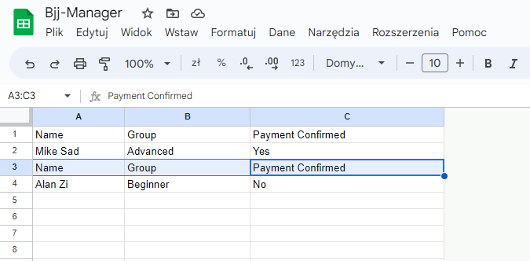
Bug fixed by:
Move the code responsible for creating the spreadsheet for the current month out of the for loop to avoid creating the same spreadsheet multiple times each time you add a participant.
Check if headers already exist in the worksheet before adding them. If the headers are already present, we will skip the step of adding them.
 
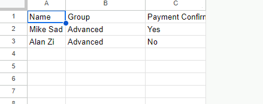
 
 
---
* There was a bug when displaying the list of members each member was marked as having paid membership.
 
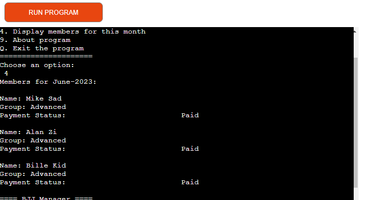
 
Bug fixed by:
I have implemented a condition in the function to verify the "Payment Confirmed" value of all participants. If the value is "Yes" (assuming it is written as "Yes" or "No" in the spreadsheet), I update the payment status to "Paid". Otherwise, I set the status to "Not Paid". This ensures that the payment status of each participant is accurately reflected.
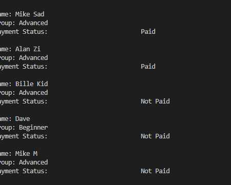

## Deploymenf of program
----
To deploy the BJJ Manager project, you can follow these steps:
* Push all the latest code to your GitHub repository.

* Go to Heroku (https://www.heroku.com/) and log in to your account.

* Once logged in, click on "New" in the top right corner of the dashboard.

* Create a new app by providing a unique app name and selecting the desired region (e.g., Europe).

* Connect your Heroku app to your GitHub repository. Search for the repository name and select it to establish the connection.

* After connecting to the repository, go to the "Settings" tab of your Heroku app.

* Under the "Buildpacks" section, click on "Add buildpack".

* Add two buildpacks in the following order:

    - Python: This will ensure that Heroku recognizes your application as a Python project.
    - Node.js: If your project has any Node.js dependencies, this buildpack will handle them.
* Save the changes to apply the buildpacks. Make sure that the "Heroku/Python" buildpack is at the top of the list, followed by "Heroku/Nodejs".

* Navigate to the "Deploy" tab of your Heroku app.

* Scroll down to the "Manual Deploy" section and click on "Deploy Branch" to deploy the selected branch (e.g., main/master).

## Credits 
----
Special thanks to my mentor, Mitoko Mentor, for their guidance and support throughout the development of BJJ Manager.

I would also like to acknowledge the following resources and websites that were instrumental in creating this program:

* Stack Overflow (https://stackoverflow.com/): A valuable community-driven platform for programming questions and answers.

* Python Documentation (https://docs.python.org/): The official documentation for the Python programming language, providing comprehensive information and examples.

* Google Developers Documentation (https://developers.google.com/): The documentation and resources provided by Google Developers, including the Google Sheets API documentation, which was essential for integrating Google Sheets with the program.

### Thank you to all the contributors and creators of the above resources for their valuable contributions to the development community.